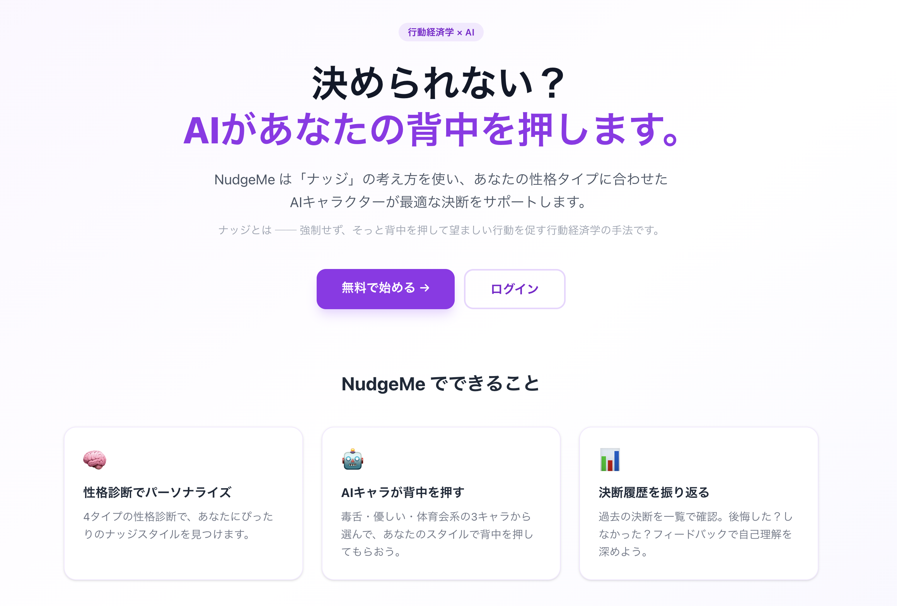
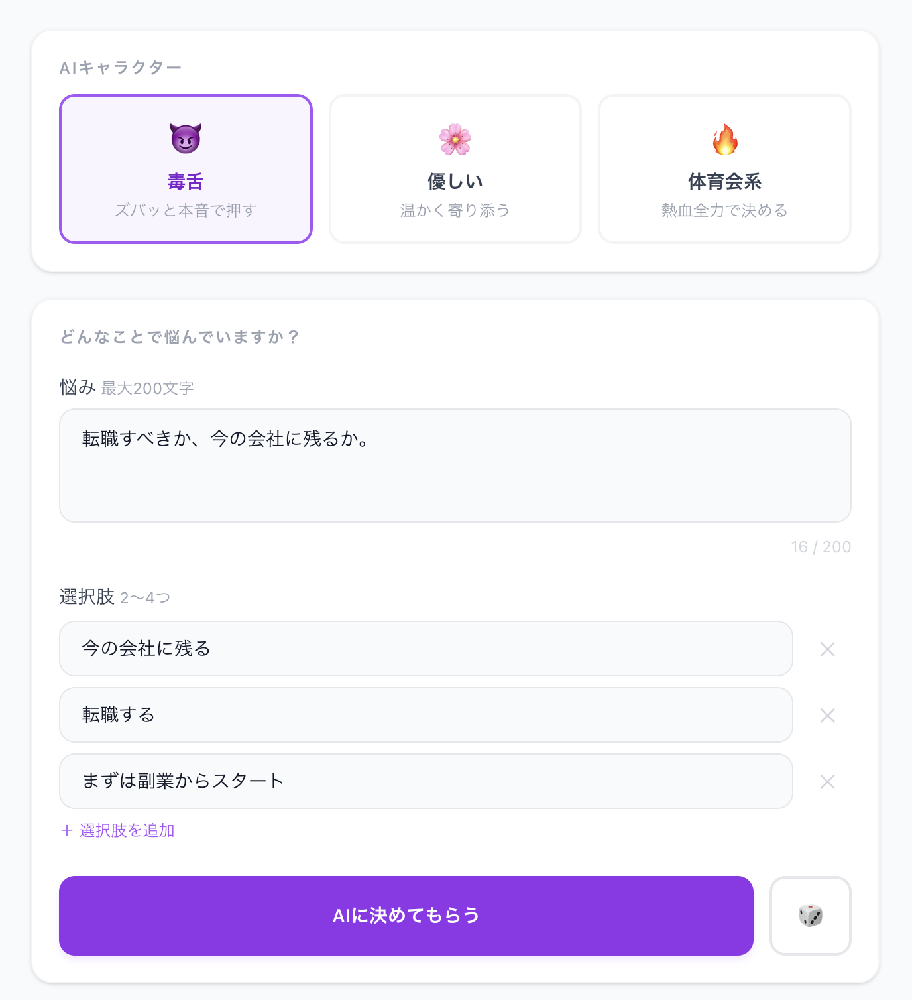
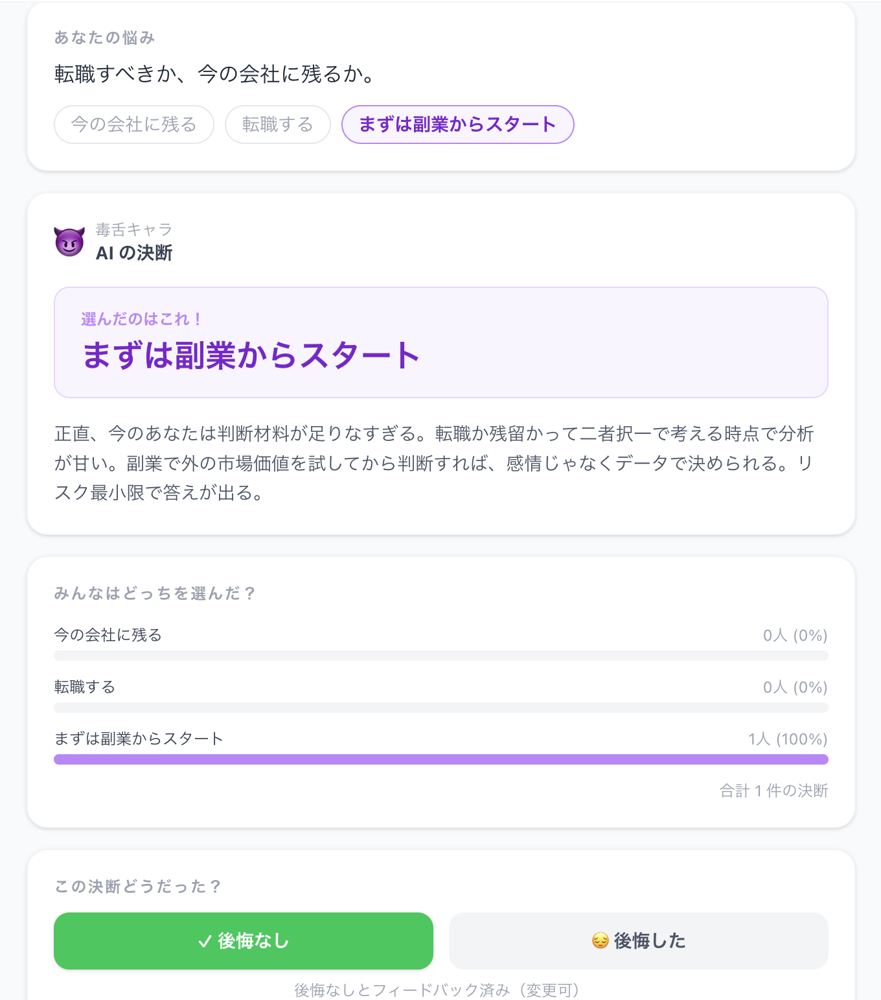

# NudgeMe

優柔不断な人を AI がナッジして意思決定を助ける Web アプリ。

> **Nudge（ナッジ）とは？**
> 行動経済学の概念で、強制せず自然な形で人の行動を望ましい方向へ誘導する仕掛けのこと。
> リチャード・セイラーによって提唱され、2017年のノーベル経済学賞を受賞した理論。

---

## What is NudgeMe?

「どっちにしようかな…」と迷ったとき、NudgeMe があなたの性格タイプを分析し、
AI キャラクターが背中を押してくれます。

- 問題と選択肢を入力する
- あなたの性格タイプに合った AI キャラクター（毒舌 / 優しい / 体育会系）が選択する
- 理由付きで決断を提示してくれる
- 過去の決断を振り返り、「後悔した / しなかった」のフィードバックも記録できる

---

## 機能一覧

### MVP
- ユーザー登録・ログイン（JWT認証）
- 性格診断クイズ（初回のみ）
- 問題・選択肢の入力
- AIキャラクター選択（毒舌 / 優しい / 体育会系）
- AIによる決断 + 理由の表示
- 決断履歴の保存・閲覧

### 拡張機能（MVP後）
- 後悔フィードバック（後悔した / しなかった）
- 「みんなはどっちを選んだ？」統計
- ランダム決断ボタン
- 性格再診断
- 結果を X（Twitter）にシェア

---

## 技術スタック

| レイヤー | 技術 |
|----------|------|
| バックエンド | Go 1.22+ / Echo v4 / AWS Lambda |
| フロントエンド | Next.js 15 / TypeScript / Tailwind CSS v4 / AWS Amplify |
| DB | Amazon DynamoDB |
| AI | Claude API（claude-haiku-4-5） |
| 認証 | JWT（HS256） |
| インフラ | AWS Lambda + API Gateway + Amplify / Terraform |

---

## アーキテクチャ

```
ブラウザ
    │
    ▼
AWS Amplify（Next.js 15 SSR）
    │  /api/v1/* → Next.js rewrites → API Gateway
    ▼
AWS API Gateway（HTTP API）
    │
    ▼
AWS Lambda（Go + Echo）
    │
    ├──→ Amazon DynamoDB（users / decisions / personality-questions）
    └──→ Anthropic API（claude-haiku-4-5）
```

---

## セットアップ

### 前提条件

- Go 1.22 以上
- Node.js 20 以上
- Anthropic API キー
- AWS CLI（本番デプロイ時）
- Terraform（インフラ構築時）

### 1. バックエンド起動（ローカル）

```bash
cd backend
cp .env.example .env
# .env を編集して ANTHROPIC_API_KEY・JWT_SECRET・DynamoDB設定を記入
go mod tidy
go run main.go
```

### 2. フロントエンド起動

```bash
cd frontend
npm install
cp .env.example .env.local
# .env.local に NEXT_PUBLIC_API_URL=http://localhost:8080 を設定
npm run dev
```

ブラウザで `http://localhost:3000` を開く。

### 3. 本番インフラ構築（Terraform）

```bash
cd terraform
cp terraform.tfvars.example terraform.tfvars
# terraform.tfvars に ANTHROPIC_API_KEY・JWT_SECRET を設定
terraform init
terraform apply
```

---

## 本番環境

**URL:** https://main.d2t4un0fj1m2x8.amplifyapp.com

| ページ | URL |
|--------|-----|
| ランディング | https://main.d2t4un0fj1m2x8.amplifyapp.com/ |
| 新規登録 | https://main.d2t4un0fj1m2x8.amplifyapp.com/register |
| ログイン | https://main.d2t4un0fj1m2x8.amplifyapp.com/login |
| ダッシュボード | https://main.d2t4un0fj1m2x8.amplifyapp.com/dashboard |
| 決断履歴 | https://main.d2t4un0fj1m2x8.amplifyapp.com/history |

---

## スクリーンショット

### ランディングページ


### ダッシュボード


### AI決定結果


---

## ドキュメント

- [要件定義書](docs/requirements.md)
- [API仕様書](docs/api-spec.md)
- [画面設計書](docs/screen-design.md)
- [インフラ構成](docs/infrastructure.md)
